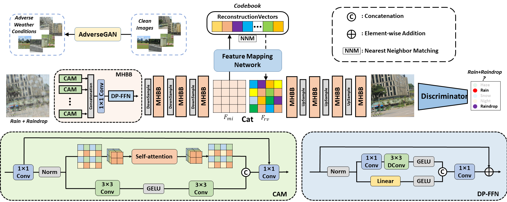
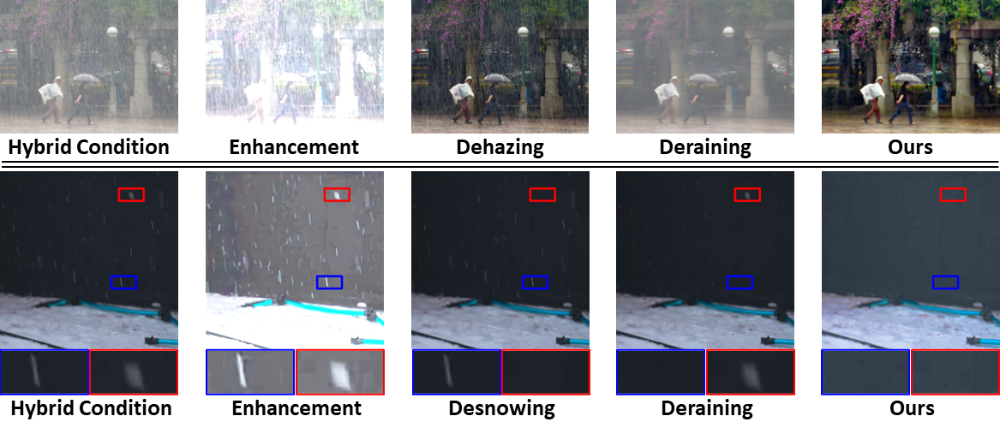

# Restoring Images Captured in Arbitrary Hybrid Adverse Weather Conditions in One Go (in submission)


> **Abstract:** *Adverse conditions typically suffer from stochastic hybrid weather degradations (e.g., rainy and hazy night), while existing image restoration algorithms envisage that weather degradations occur independently, thus may fail to handle real-world complicated scenarios. Besides, supervised training is not feasible due to the lack of comprehensive paired dataset to characterize hybrid conditions. To this end, we have advanced the forementioned limitations with two tactics: framework and data. On the one hand, we present a novel unified framework, dubbed RAHC, to Restore Arbitrary Hybrid adverse weather Conditions in one go, which can comfortably cope with hybrid scenarios with insufficient remaining image constituents and restore arbitrary hybrid conditions with a single trained model flexibly. On the other hand, we establish a new dataset, termed HAC, for learning and benchmarking arbitrary Hybrid Adverse Conditions restoration. HAC contains 31 scenarios composed of an arbitrary combination of five common weather, with a total of ∼316K adverse-weather/clean pairs. As for fabrication, the training set is automatically generated by a dedicated AdverseGAN with no-frills labor, while the test set is manually modulated by experts for authoritative evaluation. Extensive experiments yield superior results and in particular establish new state-of-the-art results on both HAC and conventional datasets.* 

## Framework Architecture
<table>
  <tr>
    <td>  </td>
  </tr>
  <tr>
    <td><p align="center"><b>Overall Framework of RAHC</b></p></td>
  </tr>
</table>


## `Installation`
`The model is built in PyTorch 1.1.0 and tested on Ubuntu 16.04 environment (Python3.7, CUDA9.0, cuDNN7.5).`

For installing, follow these intructions
```
conda create -n pytorch1 python=3.7
conda activate pytorch1
conda install pytorch=1.1 torchvision=0.3 cudatoolkit=9.0 -c pytorch
pip install matplotlib scikit-image opencv-python timm einops ptflops PIL argparse
```

## Training
- Download the [dataset](dataset/README.md) and run

```
cd dataset
python prepare.py
```
-  Download the pre-trained [VQGAN](https://heibox.uni-heidelberg.de/d/2e5662443a6b4307b470/) and place it in `./logs/`
-  Train the model with default arguments by running

```
python train.py
```


## Evaluation

1. Download the pre-trained model and place it in `./checkpoints/`

2. Download the dataset and place it in `./datasets/`

3. Run
```
python test.py
```
4. Visual results wii be saved in results


## Real-world Results
<table>
  <tr>
    <td>  </td>
  </tr>
</table>


